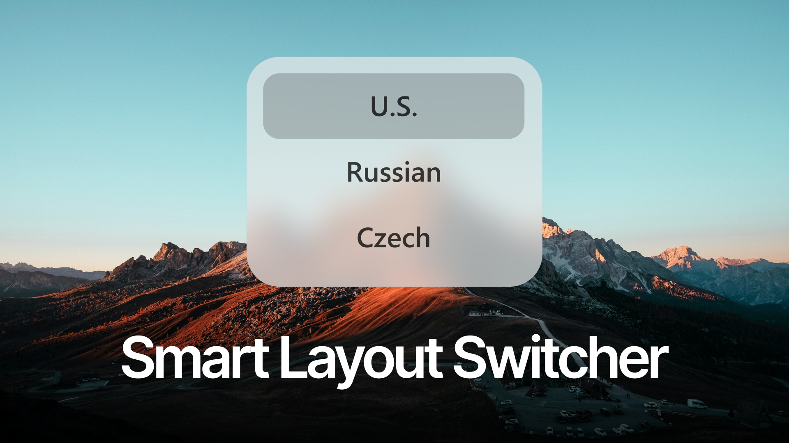

# Smart Layout Switcher

<p align="center">
  
</p>

**A Mac-like keyboard layout switcher for Windows.** Switch instantly between your two working languages with one shortcut, or hold it to open a beautiful visual picker for every layout installed in Windows.

Smart Layout Switcher stays quietly in the system tray, never adds its own keyboard layouts, and is designed to keep normal typing uninterrupted. It works only with the languages and layout variants already configured for the current Windows user.



## Download and install

Download the latest `SmartLayoutSwitcher-Setup-<version>.exe` from the [GitHub Releases page](https://github.com/vldpotapov/SmartLayoutSwitcher/releases/latest), run it, and follow the installer. During installation, choose **Win + Space** (the default) or **Left Alt + Left Shift** as your switching shortcut; it can be changed later in Settings.

The installer is self-contained: the .NET runtime is included. Windows 10 or Windows 11, 64-bit, is required.

## How it works

- A short press of the selected shortcut switches between your two working layouts.
- Hold the shortcut to show the language popup.
- While it is open, release the second key and press it again to move through layouts. Release the first key to apply the selected layout and close the popup.
- The active layout appears first in the popup, its paired layout second, followed by any other layouts installed in Windows.
- The popup uses a snapshot of the desktop behind it for a soft background-blur effect. The snapshot is taken only when the popup opens, so it does not consume CPU while the app is idle.
- The app never installs or loads layouts: it uses only the layouts and variants configured in Windows for the current user.

## Settings

Open **Settings…** from the tray icon to configure:

- the shortcut: **Win + Space** or **Left Alt + Left Shift**;
- popup display on a long press;
- per-window layout memory;
- launch at Windows sign-in;
- automatic daily update checks, with a turquoise dot on the tray icon when an update is ready;
- checking manually, then opening the latest official release in the browser from Settings;
- the project link.

The tray menu provides the current layout, the active pair, Settings, and Exit.

## Build from source

Requirements: Windows 10/11, the .NET 8 SDK, and Inno Setup 6 or later to build the installer.

```powershell
dotnet test .\tests\SmartLayoutSwitcher.Core.Tests\SmartLayoutSwitcher.Core.Tests.csproj -c Release
dotnet publish .\src\SmartLayoutSwitcher.App\SmartLayoutSwitcher.App.csproj -c Release -r win-x64 --self-contained true -p:PublishSingleFile=true -o .\artifacts\publish
iscc .\installer\SmartLayoutSwitcher.iss
```

The setup executable will be created in `artifacts\installer`.

## Project structure

```text
src/SmartLayoutSwitcher.App       WPF tray application, popup, settings
src/SmartLayoutSwitcher.Core      Hotkey and layout-selection logic
src/SmartLayoutSwitcher.Native    Windows keyboard/layout interop
tests/                            Unit tests for the core logic
installer/                        Inno Setup installer definition
```

## License

[MIT](LICENSE) © 2026 Vladimir Potapov.
