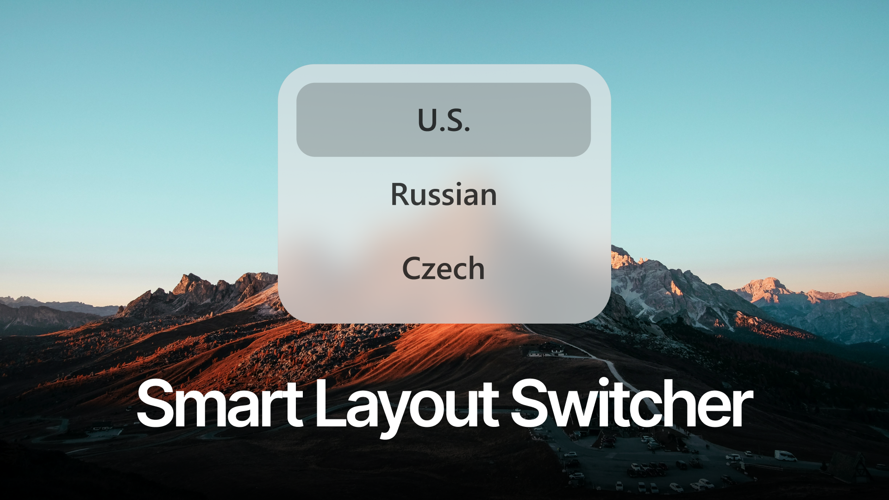

# Smart Layout Switcher

<p align="center">
  
</p>

**A Mac-style keyboard language switcher for Windows.**

Smart Layout Switcher brings familiar Mac-style language switching to Windows, with a compact, rounded picker and a softly blurred background. Tap your shortcut to switch between your two working layouts. Hold it to choose from the keyboard layouts already installed in Windows.

If you type a word in the wrong language, select it and press **Win + Left Alt + Space**. The app remaps the characters to the other language in your active pair and switches to that layout, so you can keep typing without interruption.

It stays quietly in the system tray, adds no layouts of its own, and works solely with the languages and layout variants configured for the current Windows user.



## Download and install

Download the latest `SmartLayoutSwitcher-Setup-<version>.exe` from the [GitHub Releases page](https://github.com/vldpotapov/SmartLayoutSwitcher/releases/latest), run it, and follow the installer. During installation, choose **Win + Space** (the default) or **Left Alt + Left Shift** as your switching shortcut; it can be changed later in Settings.

The installer is self-contained: the .NET runtime is included. Windows 10 or Windows 11, 64-bit, is required.

## How it works

- On first launch, the first two installed layouts in Windows become your working pair. The pair is saved for the next launch.
- A short press of the selected shortcut switches between your two working layouts.
- Hold the shortcut to show the language popup.
- While it is open, release the second key and press it again to move through layouts. Release the first key to apply the selected layout and close the popup.
- The active layout appears first in the popup, its paired layout second, followed by any other layouts installed in Windows.
- Choosing a layout outside the pair in the popup replaces the active member and keeps the other member. To change one side of the pair, activate that side first, then choose its replacement.
- The popup uses a snapshot of the screen behind it for a soft background-blur effect. The snapshot is taken only when the popup opens; the background does not update continuously.
- The app never installs or loads layouts: it uses only the layouts and variants configured in Windows for the current user.
- Select text typed in the wrong layout and press **Win + Left Alt + Space** to remap it to the other layout in the active pair. The active layout then changes to that paired layout. Characters that do not belong to the source layout are left unchanged.

## Settings

Open **Settings** from the tray icon to configure:

- the shortcut: **Win + Space** or **Left Alt + Left Shift**;
- popup display on a long press;
- per-window layout memory;
- selected-text correction with **Win + Left Alt + Space**;
- launch at Windows sign-in.

The app checks for updates at launch when its cached check is more than a day old. An orange dot on the tray icon indicates an available update. You can also check manually in Settings and open the release page in your browser. Updates are installed by running the new installer over the existing installation.

The tray menu shows the current layout, the active pair, **Settings**, and **Quit**. With per-window memory enabled, the app remembers a layout for each window during the current session.

## Text correction and diagnostics

Text correction remaps characters between keyboard layouts; it does not translate between languages. It uses the application's standard copy/paste shortcuts, so the selected text must support copying and pasting. Clipboard contents are restored when possible, provided another app has not changed them during the operation.

Diagnostic logging is disabled by default. For troubleshooting, you can enable it by setting `DebugLogEnabled` to `true` in `%APPDATA%\SmartLayoutSwitcher\settings.json` while the app is closed. Logs contain shortcut events, layout identifiers and foreground process names/window handles, but never typed text or clipboard contents. They stay on your computer in `%APPDATA%\SmartLayoutSwitcher\smart-layout-switcher.log`, with one rotated `.previous` file, about 2 MB each. The app does not upload them. Existing log files are not deleted when logging is disabled.

**Version numbering:** `1.0.30` resumes the original version sequence after the temporary `1.0.0` / `1.0.1` numbering reset. It is newer than all previous releases, including `1.0.28`, so existing installations can detect it as an update. Run the latest installer over your existing installation; your settings are retained.

## Build from source

Requirements: Windows 10/11, the .NET 8 SDK, and Inno Setup 6 or later to build the installer.

```powershell
dotnet test .\tests\SmartLayoutSwitcher.Core.Tests\SmartLayoutSwitcher.Core.Tests.csproj -c Release
dotnet build .\SmartLayoutSwitcher.sln -c Release
dotnet publish .\src\SmartLayoutSwitcher.App\SmartLayoutSwitcher.App.csproj -c Release -r win-x64 --self-contained true -p:PublishSingleFile=true -o .\artifacts\publish
iscc .\installer\SmartLayoutSwitcher.iss
```

Use a fresh `artifacts\publish` directory when preparing an installer. The setup executable will be created in `artifacts\installer`. The installer uses solid `lzma2/ultra64` compression and excludes debug symbols and satellite resource assemblies; the self-contained Windows x64 download is approximately 53 MB.

## Project structure

```text
src/SmartLayoutSwitcher.App       WPF tray application, popup, settings
src/SmartLayoutSwitcher.Core      Hotkey and layout-selection logic
src/SmartLayoutSwitcher.Native    Windows keyboard/layout interop
tests/                            Unit tests for the core logic
installer/                        Inno Setup installer definition
```

## License

[MIT](LICENSE) © 2026 Vladimir Potapov.
